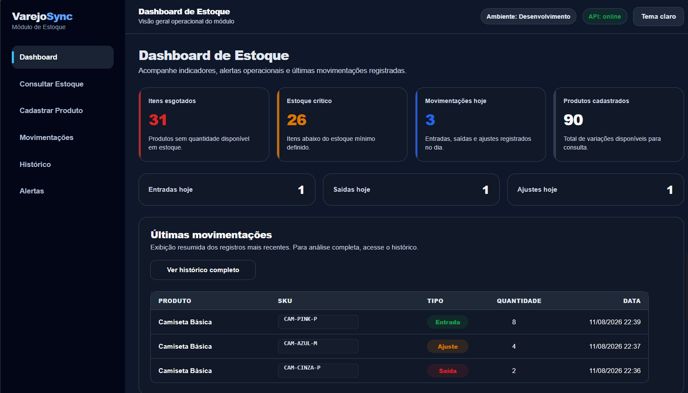
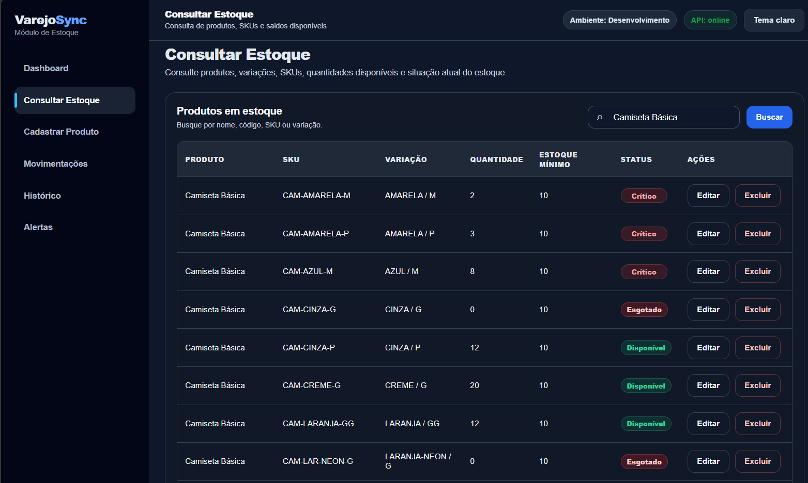
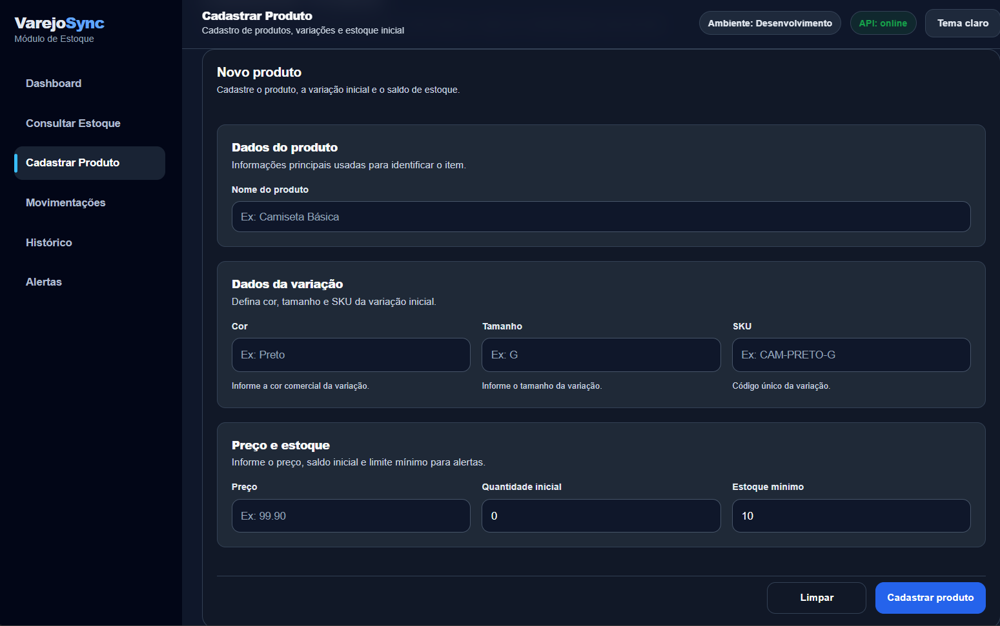

# VarejoSync — Estoque QA

Projeto de Quality Assurance aplicado ao módulo de estoque do **VarejoSync**, com testes funcionais, API REST, validações em banco de dados e automação de interface.

A cobertura atual está concentrada em **cadastro e edição de produtos, regras de SKU e exclusão**, com validações realizadas no frontend, Postman e SQLite.

**QA:** Postman · SQL · Java · Selenium WebDriver · JUnit
**Aplicação:** HTML · CSS · JavaScript · Node.js · Express · SQLite

---

## Visualização do sistema

O módulo possui uma interface web utilizada na execução dos testes funcionais e automatizados.

### Dashboard de estoque



### Consulta de estoque



### Cadastro de produto



As principais telas envolvidas na cobertura atual são:

* dashboard de estoque;
* cadastro e consulta de produtos;
* cadastro de variações;
* edição de produtos;
* consulta de estoque.

### Interface

> **A aplicação ainda não possui uma demonstração pública.**
>
> As evidências visuais dos testes permitem consultar o comportamento da interface, API e banco de dados. O próximo passo do projeto é disponibilizar o módulo em ambiente acessível pelo navegador.

---

## O que foi testado

| Área           | Cobertura desenvolvida                                             |
| -------------- | ------------------------------------------------------------------ |
| Cadastro       | cadastro válido, campos obrigatórios, mensagem e persistência      |
| SKU            | formato, obrigatoriedade, normalização e duplicidade               |
| Edição         | busca, alteração, salvamento e resultado                           |
| Exclusão       | API, banco de dados e comportamento do frontend                    |
| API            | requisições, respostas, status codes e regras de negócio           |
| Banco de dados | persistência, consulta por SKU, alteração, exclusão e investigação |
| Automação      | tela inicial, cadastro positivo, edição e cenário negativo         |

Funcionalidades de movimentação, histórico e alertas também fazem parte do módulo, mas não representam o foco principal da cobertura atual.

---

## Contexto da aplicação

O módulo de estoque faz parte do projeto **VarejoSync**, voltado ao contexto de varejo.

A aplicação utilizada nos testes possui:

* dashboard de estoque;
* cadastro de produtos e variações;
* consulta de produtos;
* edição;
* consulta de estoque;
* movimentações de entrada, saída e ajuste;
* alertas de estoque mínimo;
* histórico de movimentações;
* operações de exclusão pela API.

O projeto não possui autenticação.

---

## Estratégia de validação

Os cenários partem das regras de negócio definidas para cada comportamento.

```text
Regra de negócio
        ↓
Critério de aceite
        ↓
Cenário de teste
        ↓
Execução
        ↓
Resultado esperado x resultado obtido
        ↓
Evidência
```

Quando o resultado apresentado na interface não é suficiente para determinar o comportamento da aplicação, a investigação continua pelas demais camadas:

```text
Frontend
   ↓
API
   ↓
Banco de dados
```

Esse processo foi utilizado, por exemplo, na investigação do problema encontrado durante a exclusão de produto.

---

# Regra de negócio em destaque — unicidade do SKU

Uma das regras analisadas com maior profundidade no projeto é a unicidade do SKU das variações.

Antes da comparação, o sistema deve:

1. remover espaços no início e no fim do SKU;
2. converter o valor para letras maiúsculas;
3. comparar o SKU normalizado com os registros existentes.

### Exemplos

| Entrada       | Condição                       | Resultado esperado |
| ------------- | ------------------------------ | ------------------ |
| `CAM-PRETO-G` | SKU não cadastrado             | aceitar            |
| `CAM-AZUL-M`  | SKU já cadastrado              | rejeitar           |
| `cam-azul-m`  | mesmo SKU em minúsculas        | rejeitar           |
| `CAM-AZUL-M`  | mesmo SKU com espaços externos | rejeitar           |

Quando o SKU normalizado já estiver associado a outra variação, o cadastro deve ser bloqueado.

```text
409 Conflict
SKU já cadastrado para outra variação
```

A validação também diferencia problemas de entrada de conflitos de negócio.

Um SKU que não atende ao formato definido representa uma entrada inválida. Um SKU válido em formato, mas já existente após a normalização, representa conflito com um recurso cadastrado.

---

## Exemplo em Gherkin

```gherkin
Cenário: Impedir cadastro de SKU já existente

Dado que existe uma variação cadastrada com o SKU "CAM-AZUL-M"
Quando for realizado um novo cadastro com o SKU "cam-azul-m"
Então o sistema deve normalizar o valor informado
E identificar que o SKU já está cadastrado
E impedir o novo cadastro
E retornar a mensagem de duplicidade
```

Os cenários em Gherkin são utilizados para documentar comportamentos esperados. A automação não depende diretamente desses arquivos.

---

# Testes de API

Os endpoints do módulo são testados com **Postman**.

As validações incluem:

* método HTTP;
* endpoint;
* payload da requisição;
* status code;
* corpo da resposta;
* mensagens retornadas;
* criação e alteração de registros;
* entradas inválidas;
* duplicidade;
* exclusão;
* estado do recurso após a operação.

Entre os retornos analisados estão:

```text
200 OK
201 Created
400 Bad Request
409 Conflict
```

O status code não é utilizado isoladamente para aprovar um teste.

A resposta é comparada com a regra de negócio e, quando necessário, o estado resultante também é conferido no banco de dados.

---

# Validação em banco de dados

O módulo utiliza **SQLite**.

SQL é utilizado para confirmar o estado dos dados e apoiar a investigação dos testes.

As validações realizadas incluem:

* busca por SKU;
* confirmação de cadastro;
* consulta após alteração;
* confirmação de exclusão;
* identificação de registros duplicados;
* consulta de dados relacionados ao estoque.

### Exemplo

```sql
SELECT *
FROM variacao_produto
WHERE sku = 'CAM-AZUL-M';
```

A consulta ao banco complementa a validação funcional. Ela é especialmente útil quando o comportamento apresentado no frontend precisa ser comparado ao resultado processado pela API.

---

## Bug investigado — variações vinculadas a produtos distintos

Durante os testes de cadastro de variações foi identificada uma inconsistência no relacionamento entre produto e variação.

### Comportamento encontrado

Ao cadastrar diferentes variações de um mesmo produto, cada variação era vinculada a um `id_produto` diferente no banco de dados.

Exemplo do comportamento encontrado:

| Produto | SKU | id_produto |
|---|---|---:|
| Calça Jeans | `CAL-PRETA-P` | 10 |
| Calça Jeans | `CAL-PRETA-M` | 13 |
| Calça Jeans | `CAL-PRETA-G` | 11 |

O comportamento esperado era que as três variações permanecessem vinculadas ao mesmo produto, mantendo apenas identificadores próprios de variação.

### Investigação

A análise foi realizada comparando os dados exibidos na interface com o relacionamento persistido no banco:

```text
Cadastro das variações
        ↓
Consulta na interface
        ↓
Consulta SQL com JOIN
        ↓
Comparação dos id_produto
        ↓
Inconsistência identificada

```
A consulta confirmou que variações pertencentes ao mesmo produto estavam associadas a registros diferentes na tabela de produtos.

Impacto

A inconsistência poderia afetar operações dependentes do relacionamento entre produto e variações, como:

edição;
exclusão/inativação;
agrupamento das variações;
consulta de estoque;
movimentações;
relatórios.
Validação da correção

Após o ajuste, o cenário foi executado novamente com duas variações do produto Blusa Canelada:

BLU-PRETA-P;
BLU-PRETA-M.

A consulta no banco confirmou que ambas passaram a utilizar o mesmo id_produto.

Resultado do reteste: aprovado.

Ver bug report completo
docs/bugs/bug-001-variacoes-mesmo-produto-ids-distintos.md

Evidências: 
docs/evidencias/bug-001/01-variacoes-mesmo-produto-ui.png
docs/evidencias/bug-001/02-ids-produto-distintos-banco.png
docs/evidencias/bug-001/03-correcao-validada-banco.png


---

# Automação

Parte da cobertura funcional possui testes automatizados com:

* **Java**;
* **Selenium WebDriver**;
* **JUnit**;
* **IntelliJ IDEA**.

### Cenários automatizados

#### Tela inicial

Validação de:

* URL;
* título da página;
* seção ativa.

#### Cadastro positivo

```text
Abrir aplicação
→ acessar cadastro
→ preencher dados válidos
→ cadastrar
→ aguardar retorno da interface
→ validar mensagem
```

#### Edição

```text
Buscar produto
→ editar dados
→ salvar
→ validar resultado
```

#### Cadastro negativo

Cenário com tentativa de cadastro sem SKU e validação do comportamento retornado pela aplicação.

A automação está sendo ampliada a partir de cenários funcionais já conhecidos e executados manualmente.

---

## Estrutura da automação

O código foi separado por responsabilidade, incluindo:

* classes de teste;
* elementos utilizados na interface;
* massa de dados;
* variáveis dos fluxos;
* acesso ao banco de dados.

São utilizadas esperas explícitas com `WebDriverWait` para aguardar condições da interface antes das validações.

As verificações são realizadas com assertions do JUnit.

---

# Evidências e documentação

Os testes são acompanhados de evidências conforme o tipo de validação executada.

Entre os registros utilizados estão:

* interface;
* requisições no Postman;
* respostas da API;
* consultas SQL;
* resultados encontrados no banco;
* mensagens apresentadas pela aplicação.

Uma evidência deve permitir relacionar:

```text
cenário executado
        +
resultado esperado
        +
resultado obtido
```

Os bugs são documentados com informações necessárias para reprodução:

* título;
* ambiente ou contexto;
* pré-condições;
* passos;
* resultado esperado;
* resultado obtido;
* evidências;
* informações adicionais de API ou banco quando necessárias.

---

# Artefatos de QA

A documentação produzida no projeto inclui:

* regras de negócio;
* critérios de aceite;
* cenários de teste;
* cenários em Gherkin;
* testes positivos e negativos;
* validações de API;
* consultas SQL;
* evidências;
* bug reports;
* testes automatizados.

---

# Tecnologias e ferramentas

## QA

| Tecnologia / ferramenta | Uso                                      |
| ----------------------- | ---------------------------------------- |
| Postman                 | testes de API                            |
| SQL / SQLite            | validação e investigação de dados        |
| Java                    | implementação da automação               |
| Selenium WebDriver      | automação da interface                   |
| JUnit                   | execução e assertions                    |
| IntelliJ IDEA           | desenvolvimento dos testes automatizados |
| Git / GitHub            | versionamento e documentação             |

## Aplicação

| Tecnologia | Uso                       |
| ---------- | ------------------------- |
| HTML       | estrutura da interface    |
| CSS        | apresentação              |
| JavaScript | comportamento do frontend |
| Node.js    | backend                   |
| Express    | API                       |
| SQLite     | persistência              |

---

# Status da cobertura

### Cobertura desenvolvida

```text
Cadastro
   +
Variações / SKU
   +
Edição
   +
Exclusão
   +
API
   +
Banco de dados
   +
Automação funcional
```

### Próximas áreas de cobertura

* movimentações de entrada;
* movimentações de saída;
* ajustes de estoque;
* histórico de movimentações;
* alertas de estoque mínimo.

Essas funcionalidades já pertencem ao módulo, mas não são apresentadas neste README como cobertura concluída.

---

# Projeto

O **VarejoSync — Estoque QA** é o repositório de QA dedicado ao módulo de estoque do VarejoSync.

A documentação registra os comportamentos validados, cenários executados, consultas utilizadas, bugs encontrados e testes automatizados desenvolvidos durante a evolução do módulo.


